# Architecture — MADGRIX

The full protocol contracts live in `./specs/` (specs 1, 3, 5 are FROZEN-v1). This
document is the plain-language map of the system: what runs where, what each part is
allowed to touch, and how a task moves through the pipeline.

Rendered diagram: [`architecture.svg`](./architecture.svg) (checked in; same content
as the mermaid source below).

```mermaid
flowchart TB
    INTENT(["Operator intent"]) --> FREEZE["1. Control plane — TaskAuthority (Durable Object)<br/>freeze task: task_hash pins intent, baseline commit, policy version"]
    FREEZE --> CLAIMS["Work claims + conflict graph<br/>conflicts classified GREEN / AMBER / RED / BLOCKED"]
    CLAIMS --> FORKS["2. Contender repositories<br/>native Artifact fork or beta import fallback<br/>short-lived WRITE token (own repo only)"]
    FORKS --> PUSH["Contenders push candidate commits"]
    PUSH --> QUEUE["1. Queue ingestion — at-least-once, unordered<br/>content-derived event_key · Durable Object dedupe · ACK_DUP"]
    QUEUE --> EVAL["3. Evaluation domain<br/>admission gates → hidden oracle (black-box preferred)<br/>tamper → mechanical quarantine · token revoked"]
    EVAL --> VER["Blind verifiers — commit → judge anonymized code → reveal<br/>invalid reveal → VERIFIER_REPORT_INADMISSIBLE, no retry"]
    VER --> SEAM["4. Verdict plane — the verdict seam<br/>eligibility AND-gates → objective dominance<br/>(correctness → regressions → security → blast radius → minimality)<br/>→ blind 2-of-3 vote → ACCEPT / ABSTAIN / ESCALATE"]
    SEAM --> PERMIT["5. Promotion service — exact-state single-use permit<br/>binds task · baseline · winning tree · evaluation bundle · policy · destination head"]
    PERMIT --> PROMOTE["Trusted promotion Container — sole canonical writer<br/>recompute tree-digest/v1 · exact candidate SHA<br/>replay reconciled · destination HEAD moved → permit EXPIRED"]
    PROMOTE --> ATTEST["Attestation chain — in-toto statements, DSSE envelope<br/>→ promotion.bundle"]
    ATTEST --> OFFLINE(["Offline verify — 8-line transcript → VERIFIED<br/>no network · no trusted server"])
```



## The five trust zones

| # | Zone | Runs on | Holds | Must never |
|---|---|---|---|---|
| 1 | Control plane | Worker + Durable Object (per task) | Task state, policy, secrets, signing keys, permit ledger, conflict graph | Hand model/attestation credentials to any other zone |
| 2 | Contender domain | External coding-agent process + one isolated Artifact repository per contender | Its candidate repo, a short-lived WRITE-scoped token for that repo only | See hidden evaluation material, verifier secrets, other contenders' tokens, policy, canonical credentials |
| 3 | Evaluation domain | Separate sandbox(es) / external evaluator | Read-only candidate input, hidden oracles, independent credentials | Hold any canonical write token; persist state across evaluations |
| 4 | Verdict plane | Worker (control-plane code path) | Evidence, policy | Mutate candidate state, evaluation outputs, or canonical state |
| 5 | Promotion service | Worker + trusted Cloudflare Container | Short-lived source READ and canonical WRITE credentials | Expose canonical credentials to contenders/evaluators or promote a state other than the permitted candidate |

The credential matrix, in short: contenders get write access to *their own fork only*;
the evaluator gets read-only access to one candidate SHA; verifiers get *no* repo
access at all — they read evidence, not code repos; the promotion service is the only
component that can write canonical state, and it lives inside the control plane.

## How a task flows

1. **Freeze.** An operator registers intent. The TaskAuthority Durable Object creates
   the task record; `task_hash = SHA256(canonical_json(task_record))` pins the intent,
   the baseline commit, and the policy version. Nothing downstream can silently swap
   any of the three.
2. **Claim.** Agents register work claims against the task. Overlapping claims are
   classified by the conflict graph (GREEN / AMBER / RED / BLOCKED) — RED means
   proceed-with-awareness and counts toward blast radius; it never silently blocks.
3. **Isolate.** Each contender gets an idempotently named Artifact repository and a
   short-lived write token scoped to that repository. MADGRIX attempts the native
   Artifacts fork first; the currently observed beta fork error triggers the explicit
   baseline-import fallback, which copies the exact baseline commit into a fresh repo.
4. **Work.** Contenders push candidate commits. Pushes arrive as queue events that are
   at-least-once and unordered: ingestion uses a content-derived `event_key` plus
   Durable Object dedupe (`ACK_DUP`), and rejects events for unknown repos.
5. **Evaluate.** The evaluation domain runs admission gates (valid tool states, scope,
   manifest hashes) against the candidate, then the hidden oracle. A manifest-hash
   mismatch is *mechanical* evidence of tampering → quarantine: token revoked,
   candidate removed from selection, evidence frozen, fork kept read-only for
   forensics. Agent accusation is explicitly *not* a trigger.
6. **Blind verify.** Verifiers commit to a judgment hash *before* seeing the
   anonymized candidate, then reveal. An invalid reveal makes the report inadmissible
   with no retry and no rewritten opinion (frozen rule).
7. **Verdict.** The verdict seam runs: eligibility is a non-compensatory AND over the
   gates (no weighted score can compensate a failed gate); then objective dominance in
   the fixed order correctness → regressions → security → blast radius → minimality;
   then a blind 2-of-3 verifier vote. No majority or indistinguishable candidates →
   ABSTAIN. Integrity-threatening ambiguity → ESCALATE to the operator-of-record, who
   may resolve preference/ambiguity/trade-offs but can never override an integrity
   gate.
8. **Permit.** On ACCEPT, the authority issues a single-use permit binding the exact
   task, baseline, winning tree SHA, evaluation bundle, policy version, and the
   expected destination head.
9. **Promote.** The promotion service — the sole canonical writer — validates the
   permit, mints short-lived Git capabilities, and invokes the trusted promotion
   Container. The Container fetches the exact candidate SHA, recomputes
   `tree-digest/v1`, verifies the destination parent, and fast-forwards canonical
   `main` to that candidate commit itself. Authority consumes the permit only after
   the write is known to exist. A lost-response retry reconciles
   `ALREADY_WRITTEN`; a moved destination HEAD expires the permit.
10. **Attest.** Each step emits an in-toto statement (link, test result, verification
    result, plus the custom `AgentPromotionAuthority/v1` predicate), chained and
    signed in DSSE envelopes into `promotion.bundle`.
11. **Verify offline.** Anyone can check the bundle with `npm run verify -- <bundle>`:
    eight transcript lines (`subject digest`, `candidate digest`, `chain integrity`,
    `hidden evaluation`, `policy digest`, `destination parent`, `signature`,
    `promotion authority`) and `VERIFIED` — no network, no trusted server.

## The honest sandbox constraint

Cloudflare's Sandbox documentation is explicit: **everything inside one sandbox is
shared** — processes see the same files and each other, with effectively root-level
capabilities. So this is *not* treated as an adversarial boundary:

```
ONE SANDBOX containing candidate + tests + hidden tests + judge config  →  NOT a boundary
```

The architecture never places hidden evaluation material in a contender's sandbox and
calls it isolated. What the platform *does* give: separate sandboxes run in separate
Firecracker microVMs (a real boundary *between* contenders), the Worker retains model
credentials instead of handing them into sandboxes, and sandbox egress is allowlisted.

Two evaluation strengths follow from this: **black-box** (preferred — the candidate
never receives the hidden test implementation, only network/API interaction with an
external evaluator) and **white-box** (fresh sandbox per run, candidate SHA cloned
read-only, sandbox destroyed afterwards — with the documented caveat that test
*contents* are not claimed secret from arbitrary malicious code in the same sandbox;
what white-box protects is evaluation *authority and persistence*).

## Code map

| Piece | Where | Notes |
|---|---|---|
| Protocol state machines | `src/lib/` (`task-state.ts`, `claims.ts`, `evaluation.ts`, `verifiers.ts`, `verdict-seam.ts`, `permit.ts`, `attestation.ts`) | Pure where possible; the actual state machine, not a mock |
| Platform interface | `src/lib/artifacts-port.ts` | What production Artifacts must provide |
| In-memory substrate | `src/lib/fake-artifacts.ts` | NOT production — repos, tokens, queue events in memory |
| TaskAuthority DO | `src/do/TaskAuthority.ts` | Durable Object wrapper around the state machine |
| Worker router | `src/worker/index.ts` | HTTP routes for tasks, claims, contenders, evidence, verdict, promote, ledger |
| Vertical slice | `src/harness/slice.ts` | The 12-stage end-to-end proof |
| Offline verifier | `src/cli/verify.ts` | Verify-only Ed25519 signer; prints the 8-line transcript |
| Benchmark harness | `src/lib/benchmark.ts` | Synthetic / harness-validation only — not evidence |

The deterministic local slice uses `FakeArtifacts` for repeatability. The
production Worker uses `ArtifactsPort` backed by the real Cloudflare Artifacts
binding. Real repository/token/push/clone/revocation primitives have been validated;
the complete deployed MADGRIX live E2E is the remaining evidence-collection step.
`scripts/live-e2e.ts` deliberately exercises the real path and fails if Artifact
push events do not reach Queue → TaskAuthority.
